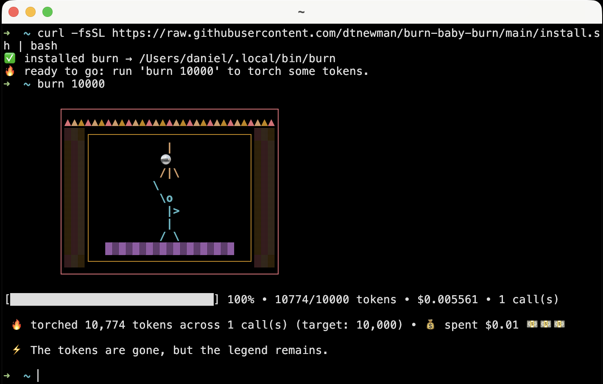

# 🔥 Burn, baby, burn (those tokens) 🔥


### Because nothing gets you promoted faster than a six-figure token bill

A bash one-liner that burns Claude Code **or Codex** tokens on purpose.

```bash
burn 50000  # burn 50,000 tokens
```

### 🆕 Now with Codex support! 🤖

Don't have Claude Code installed? No problem — `burn` now falls back to
[Codex](https://github.com/openai/codex) automatically, or pick your weapon
explicitly with `--backend`:

```bash
burn 50000 --backend codex                     # burn through OpenAI tokens
burn 50000 --backend codex --model gpt-5.5     # specify the model
```

---

## Install and run in 20 seconds

```bash
curl -fsSL https://raw.githubusercontent.com/dtnewman/burn-baby-burn/main/install.sh | bash
```

Drops `burn` into `~/.local/bin` — no sudo, no Homebrew tap. Needs
[Claude Code](https://docs.claude.com/claude-code) **or**
[Codex](https://github.com/openai/codex) authenticated on your `PATH`, plus
`jq` (`brew install jq`).

## Usage

```bash
burn 10000                            # the minimum
burn 50000 --model haiku              # cheap and fast
burn 100000 --model sonnet            # walk away
burn 50000 --backend codex            # 🤖 burn OpenAI tokens
```



---

## Features

- 📈 **Make the CEO see how productive you are.** 🔥
- 💸 **Investors will see how AI-innovative your company is.** 🚀
- 🏆 **Top the internal Claude Code leaderboard.** 👑
- 📊 **Pad your OKRs.** ✅
- 🦄 **Justify next year's bigger AI budget.** 💰

---

## Reviews

> "Wow, my engineering team is 5x more productive in just the last week!"
>
> **- (Possibly) your CEO a week after your team installs this tool**

> "We've decided to double our offer"
>
> **- (Possibly) a famous VC, after seeing AI usage stats in your new pitch deck**

---

## Stats


---

## Enterprise version

We are currently working on a paid enterprise-ready version, which will have:

- 4x burn rate
- SSO/SAML Support
- Role-Based Burn Access

Please contact us if you are interested.

---

## License

MIT (but it's all vibe-coded so who really knows who owns it?). Burn responsibly. 🔥
